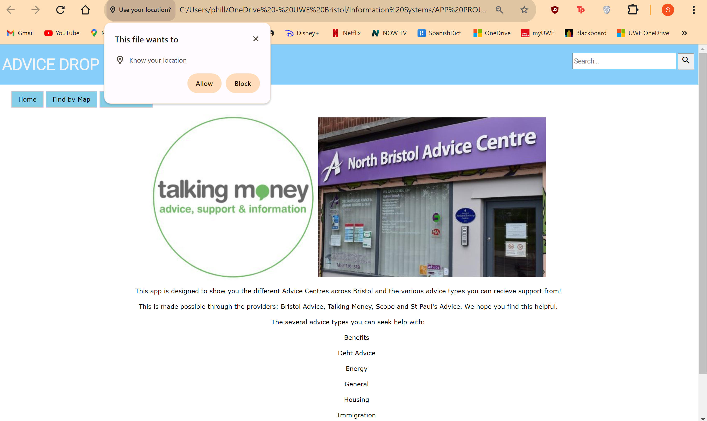

# Deployment

Version 1.0.2 of the system currently facilitates the splash page and the first two use cases. This allows users to locate nearby services as per the first use case and refine service options based on different attributes as per the second use case. Development for the third use case is ongoing. The functionality of this application relies on the Bristol Open Data API and MapBox API. Should either of these services become unavailable, the application may not function as expected. The Deployment Diagram provided below outlines the interaction between this web application and the Bristol Open Data.

# User guide
### Use Case 1: Identify Free Local Financial Advice & Support
1. User launches the application and initiates a search by entering a keyword related to their financial concern, such as "Debt". 
2. The application prompts the user to give permission to use their location to provide tailored results. 
3. User grants permission for location access. 
4. The application centres the map on the user's current location. 
5. The map displays markers for the locations of Advice centres around Bristol that offer support related to the entered keyword (e.g., debt counselling). 
6. The user clicks on a marker to view more information. 
7. A pop-up window appears, displaying the name of the advice centre and the type of financial advice and support offered (e.g., debt management, budgeting assistance). 
8. The user can click on additional markers to explore more advice centres or close the pop-up window to continue browsing the map.

### Use Case 2

1.	The app will open on the index page.
2.	The centre employee shall click on ‘Find By Type’ on the navigation bar to access the table.

3.	They will be directed to this page where they are now able to select what advice type their centre offers.

4.	For example, for debt they will select the ‘Debt’ button on the secondary navigation bar. 
5.	From here they can identify the venue, address, organisation and advice type of the centre and ensure that the information is correct. 

#### Variation 1 [Checking information on the map is correct] :

6.	 If wanting to ensure the map details are correct they will click on ‘Find By Map’, where a pop-up asking to use their location will appear

7.	If the user selects ‘allow’, the map will centre on their location. If they choose not to share their location, the map will default to the centre of Bristol. 

8.	From here the user can zoom in and out or drag on the map until they find their advice centre.
9.	The employee can now click on the drop pin, where information regarding the centre’s venue name and advice type will appear. Here they can check if the correct information is displayed. 

#### Variation 2 [Checking search bar]:

10.	Employees can also search for their centre using the search bar. Here they can type in the selected advice type.

11.	They will then be directed to the table page where they are able to select the desired advice type offered by their centre and identify whether the information displayed is correct on the table. 

