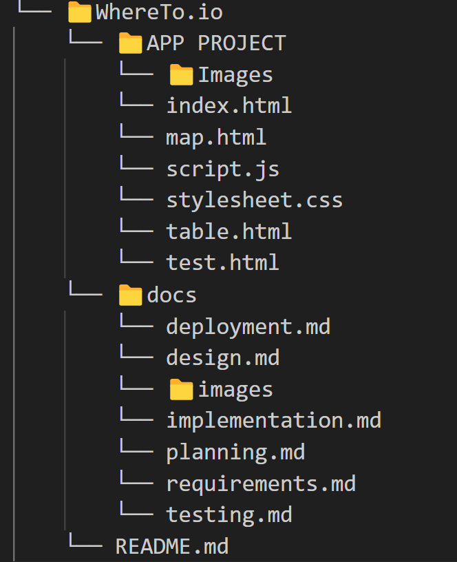

# Implementation

## Introduction
<body> 
The system implemented is a web-based application for accessing information about advice drop-in centres. Here's a description of the system components:
<h4>Dataset: </h4>

The dataset is sourced from a server hosting geospatial data about advice drop-in centres in Bristol, UK. This data includes information such as venue names, addresses, organizations, and advice types. The data is retrieved in JSON format via AJAX requests to a specific URL endpoint (https://maps2.bristol.gov.uk/server2/rest/services/ext/ll_community_and_safety/MapServer/22/query). The response JSON object contains an array of features, each representing an advice drop-in centre, with attributes like venue name, address, organization, and advice type. The dataset is dynamically loaded into the web page's table element to display advice centre information in a tabular format.

  

 The system's HTML and JavaScript code doesn't directly include configuration data, the URL endpoint for data retrieval and the mapping of advice types to querying parameters, are hardcoded within the JavaScript functions (outputtable and query).

One challenge faced with the dataset was the inability to group it based on the nearest user location. Additionally, there were instances where it retrieved other services that were not relevant to the service being used. However, this issue has been addressed and resolved.

</body>

## Project Structure
The outline of the project folder structure can be seen in the image below:

The main app ‘Advice Drop-In Centre’ is located within the ‘APP PROJECT’ folder, with index.html as the splash page and JavaScript and CSS pages included here. Images that are used within the app are located in a separate folder, ‘Images’. Test scripts are located in the test folder. 

This is the lint output for script.js:

Error
1:10

'getLocation' is defined but never used.  (no-unused-vars)
Error
2:3

'navigator' is not defined.  (no-undef)
Error
3:15

'console' is not defined.  (no-undef)
Error
4:15

'error' is not defined.  (no-undef)
Error
7:9

'navigator' is not defined.  (no-undef)
Error
8:9

'navigator' is not defined.  (no-undef)
Error
10:13

'location' is not defined.  (no-undef)
Error
14:13

'location' is not defined.  (no-undef)
Error
19:9

'alert' is not defined.  (no-undef)
Error
21:9

'location' is not defined.  (no-undef)

## Software Architecture
The major components of the software architecture are listed below:

<html>
  <body>
    <h3> <b>Client-side Components</b> </h3>
     
 UI serves as the primary point of interaction between users and the website, facilitating information access, navigation, interaction, feedback, and brand representation. At the same time, client-side scripting with JavaScript frameworks empowers developers to create dynamic, interactive, and feature-rich web applications that deliver engaging user experiences across different platforms and devices. A well-designed UI enhances the user experience, promotes engagement, and contributes to the website's success.

    <h5> User Interface (UI) </h5>
    
The User Interface (UI) is a crucial component of a website that helps users locate locations and services for several reasons: 

    <li> User Experience (UX): The UI directly impacts the user experience. An intuitive and visually appealing interface enhances user satisfaction and encourages users to engage with the website. Clear navigation, well-designed forms, and interactive elements make it easier for users to find the necessary information. </li>
    <li> Information Access: The UI provides users with access to various features and functionalities of the website, such as maps, search bars, filters, and interactive elements. These UI components enable users to search for specific locations, browse service listings, apply filters to refine search results and interact with the website's content.</li>
    <li> Interactivity: Interactive UI elements allow users to interact with the website in meaningful ways. For example, users can input search queries, select filters to narrow down search results, click on map markers to view location details and interact with service listings to learn more about available services. </li>
    <li> Visual Representation: UI components like maps and visual representations of locations provide users with spatial context and help them visualize the geographical distribution of services. Maps allow users to explore locations visually, view nearby amenities, and plan routes to desired destinations. </li>
    <li> Accessibility: A well-designed UI ensures accessibility for users with diverse needs and abilities. Features such as clear labelling, sufficient colour contrast, keyboard navigation, and screen reader compatibility make the website accessible to a wider audience, including users with disabilities. </li>

<h5> Client-Side Scripting </h5>

 JavaScript frameworks like React.js, Vue.js, or Angular.js may be used to create dynamic and interactive features on the client side are used for several reasons in web developments: 
 

  <li> Dynamic User Interfaces: JavaScript frameworks enable developers to create dynamic and responsive user interfaces. With client-side scripting, elements of a webpage can be updated or changed without requiring a full page reload. This results in a smoother and more interactive user experience, as users can interact with the website without experiencing delays or interruptions.</li>
  <li> Single Page Applications (SPAs): JavaScript frameworks facilitate the development of SPAs, where the entire application is loaded once and subsequent interactions are handled dynamically on the client side. SPAs provide a seamless browsing experience similar to a desktop application, as users navigate between different views without page refreshes.</li>
  <li> Component-Based Architecture: Frameworks such as React.js, Vue.js, and Angular.js promote a component-based architecture, where UI elements are encapsulated into reusable components. This modular approach simplifies development, improves code organization, and facilitates code reuse, leading to more maintainable and scalable applications. </li>
  <li> Efficient DOM Manipulation: JavaScript frameworks abstract away low-level DOM manipulation tasks, providing higher-level APIs for interacting with the Document Object Model (DOM). This abstraction simplifies development and improves performance by optimizing DOM updates and minimizing reflows and repaints. </li>
  <li> State Management: Client-side scripting frameworks often come with built-in state management solutions or libraries (e.g., Redux for React.js, Vuex for Vue.js, NgRx for Angular.js). These tools help manage the application state, handle data flow, and synchronize UI changes with underlying data sources, ensuring consistency and predictability in the application's behaviour.</li>
  <li> Cross-Platform Compatibility: JavaScript frameworks enable developers to build cross-platform applications that run seamlessly on different devices and browsers. By leveraging web standards and modern browser APIs, client-side scripting frameworks ensure compatibility and consistency across platforms, including desktops, tablets, and mobile devices.</li>
  <li> Rich UI Components: Frameworks like React.js, Vue.js, and Angular.js offer extensive libraries of UI components and plugins that developers can use to enhance the visual appearance and functionality of their applications. These pre-built components save development time and effort, allowing developers to focus on building unique features and solving specific business challenges. </li>
  <li> Developer Productivity: JavaScript frameworks streamline the development process by providing tools, utilities, and conventions that boost developer productivity. Features like hot module replacement (HMR), code splitting, and scaffolding tools enable rapid prototyping, iteration, and deployment of applications. </li>

<h5> <b>Server-side Components</b> </h5>
     
 Web servers, application servers, and proxy servers play critical roles in the architecture of web applications.

Web servers are responsible for hosting and delivering web applications to clients, handling requests, delivering content, executing application logic, ensuring security, facilitating scalability, maintaining compatibility, and providing monitoring capabilities.

Application servers serve as the backbone of the backend architecture, executing business logic, generating dynamic content, interacting with external services, managing sessions, ensuring scalability and concurrency, integrating with frameworks and middleware, and enforcing security measures.

Proxy servers act as intermediaries between clients and backend servers, enhancing security, performance, scalability, and manageability. They handle request routing, authentication, caching, rate limiting, load balancing, content transformation, and monitoring/logging, contributing to the overall efficiency and reliability of web applications.
 

<h5>Web Server</h5>

The web server hosts the backend application code and serves web pages to clients upon request for several reasons: 

<li> Request Handling: A web server efficiently handles incoming HTTP requests from clients (web browsers) and processes them according to the logic defined in the backend application code. </li>
<li> Content Delivery: The web server delivers static content (such as HTML, CSS, and JavaScript files) directly to clients without processing. This ensures fast and efficient content delivery, reducing latency and improving the overall user experience.</li>
<li> Application Logic Execution: The web server executes the backend application code, which may involve querying databases, processing data, generating dynamic content, and performing other business logic tasks. </li>
<li> Routing and URL Mapping: Web servers implement routing and URL mapping mechanisms to determine how incoming requests are mapped to specific endpoints or resources within the backend application. </li>
<li> Security: Web servers often include built-in security features and mechanisms to protect against common threats, such as denial-of-service (DoS) attacks, cross-site scripting (XSS), and SQL injection. They may also support SSL/TLS encryption for secure communication between clients and the server.</li>
<li> Scalability: Web servers are designed to handle a large volume of concurrent connections and scale horizontally to accommodate increasing traffic and workload demands. They can distribute incoming requests across multiple server instances or nodes for improved performance and reliability.</li>
<li> Logging and Monitoring: Web servers typically provide logging and monitoring capabilities to track server performance, request metrics, error logs, and other relevant data. This information helps administrators diagnose issues, optimize performance, and ensure the reliability of the server infrastructure.</li>  

<h5>Application Server</h5>

This component processes requests from the client, interacts with external APIs, performs business logic, and generates dynamic content, reasons for developments are: 

<li> Request Processing: The Application Server processes incoming requests from clients (such as web browsers or mobile apps) and determines how to handle them based on the application's logic and configuration. </li>
<li> Business Logic Execution: It executes the business logic of the application, which may involve retrieving data from databases, processing user input, performing calculations, and applying business rules.</li>
<li> Interaction with External APIs: The Application Server interacts with external APIs to retrieve data or perform actions required by the application. This could include integrating with third-party services for payment processing, geolocation, social media, or other functionalities. </li>
<li> Session Management: Application Servers often handle session management, maintaining stateful interactions with clients across multiple requests. This allows the application to track user sessions, store session data, and maintain user authentication and authorization states. </li>
<li> Security: Application Servers implement security measures to protect against common web vulnerabilities, such as cross-site scripting (XSS), SQL injection, cross-site request forgery (CSRF), and others. They may provide features like input validation, output encoding, access control, and encryption to safeguard sensitive data and ensure the integrity of the application.</li>
<h5>Proxy Server</h5>

 A proxy server routes requests to the external open-source website's API, handles authentication and manages rate limiting.

<li> Request Routing: A Proxy Server can route incoming client requests to different backend servers or services based on predefined rules or configurations. This enables load balancing, traffic distribution, and optimization of resources across multiple servers or endpoints.</li>
<li> Security: Proxy Servers can enhance security by acting as an intermediary between clients and backend servers. They can hide the internal network topology and IP addresses of backend servers, making it more difficult for attackers to target them directly. Additionally, proxies can inspect and filter incoming requests for malicious content, preventing attacks such as SQL injection, cross-site scripting (XSS), and cross-site request forgery (CSRF).</li>
<li> Caching: Proxy Servers can cache responses from backend servers to improve performance and reduce latency for subsequent requests. By storing copies of frequently accessed data locally, proxies can serve requests more quickly without the need to retrieve data from the origin server each time. </li>
<li> Content Transformation: Proxy Servers can modify or transform the content of requests and responses as they pass through the proxy. This allows for tasks such as content compression, encryption, protocol translation, or adding/removing headers for compatibility or security reasons. </li>
<li> Monitoring and Logging: Proxy Servers can log and monitor incoming and outgoing traffic, providing insights into usage patterns, performance metrics, and security events. This information can be valuable for troubleshooting, auditing, compliance, and performance optimization purposes. </li>

<h5>Data Storage and Retrieval</h5>

 External API Integration enables the website to access external data or services, while Caching optimizes performance by storing frequently accessed data locally, thereby reducing latency and improving the overall user experience. Often used use to:

<li> Access to External Data: External APIs provide access to a wide range of data and services that may not be available within the website's database or systems. This includes location data, service listings, reviews, and other relevant information that can enhance the functionality and content of the website. </li>
<li> Enhancing User Experience: By integrating external APIs, websites can offer richer and more dynamic user experiences. For example, displaying real-time weather updates based on location data or providing personalized recommendations based on user preferences retrieved from external sources. </li>
<li> Keeping Data Fresh and Updated: External APIs often provide real-time or frequently updated data. By integrating these APIs, websites can ensure that the information presented to users is always current and accurate without the need for manual updates. </li>
<li>Reduced Latency: Fetching data from an external API typically involves network communication, which can introduce latency or delays. Caching locally eliminates the need for this network communication, leading to quicker data retrieval and response times. </li>
<li> Bandwidth Conservation: Caching helps conserve bandwidth by reducing the volume of requests sent to the external API. This is particularly beneficial for applications with limited bandwidth or those serving a large number of users simultaneously.</li>
<li>Fault Tolerance: Caching locally can provide a level of fault tolerance in case the external API experiences downtime or becomes unavailable. Cached data remains accessible even if the external API is temporarily inaccessible, ensuring continuity of service for users.</li>
<li>Cost Savings: By reducing the frequency of requests to the external API, caching can help lower the costs associated with API usage, particularly for APIs that charge based on request volume or data transfer. </li>

<h5> Third-party Integartions</h5>

 Integration of open-source website APIs offers developers a cost-effective, feature-rich, and flexible solution for accessing diverse data, mapping and geolocation services, social media integration, and other functionalities, enhancing the user experience in web and app development.

<li> Access to Diverse Data: Open-source APIs often provide access to a wide range of data, including location data, service listings, and other relevant information. This data can enrich the content and functionality of websites and apps, enhancing the overall user experience.</li>
<li> Cost-effectiveness: Open-source APIs are typically free to use or offer affordable pricing plans, making them a cost-effective solution for accessing valuable data and services without the need to develop proprietary solutions from scratch.</li>
<li> Mapping and Geolocation Services: Integration with mapping and geolocation services like Google Maps API or Mapbox API allows developers to incorporate interactive maps, location-based services, and geospatial data visualization into their applications. This enhances the user experience by providing visual representations of locations and services, improving navigation, and enabling location-based features. </li>
<li> Social Media Integration: Open-source APIs often provide integration with popular social media platforms like Facebook, Twitter, or Instagram. This enables developers to incorporate social features such as user authentication, sharing, commenting, and social proof into their applications. Integration with review aggregators like Yelp or TripAdvisor also allows users to access reviews and ratings for service listings, helping them make informed decisions.</li>

  </body>
</html>

## Bristol Open Data API
TODO: Document each query to Bristol Open Data

TODO: Repeat as necessary
