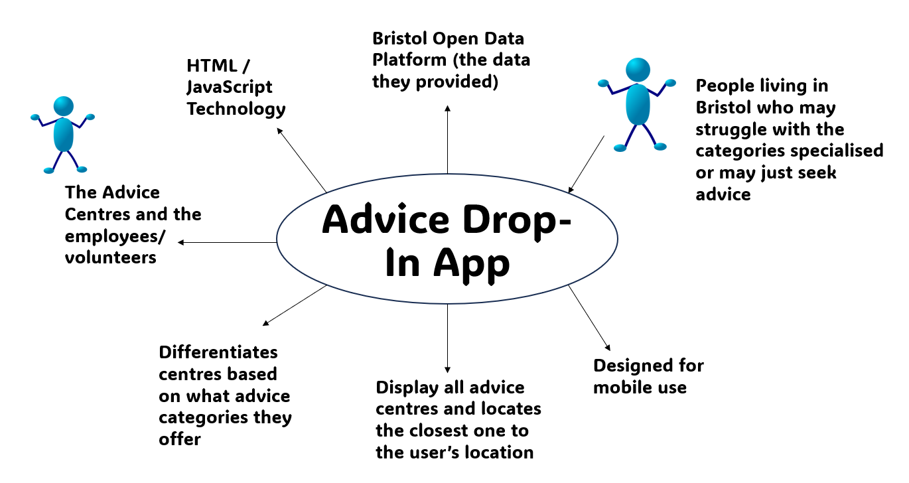

# Project Proposal

## Business Case

### Problem statement
TODO: Replace the example text like this with text that describes your project. What is the problem to be addressed?

Advice drop-in: The 'Where To' project aims to make advice drop-in centres more utilised in Bristol by giving users one place to locate the services and see which centre is most suitable for their personal situations. The app will be designed for users who may be affected by several factors in their personal lives such as finances, housing, welfare, debt etc.. who may not be aware of, or struggle to find a place of support. In which the app will provide information (location and type) that can help users to utilise the services that are already within their local area, and can help them to overcome welfare dilemmas. 

### Business benefits
TODO: List high-level benefits that this product will provide.

- Allows users to locate and have directions to their needed facilities
- Creates ease as the app will provide one place for users to seek where the centres are located and which ones can provide advice for their specific needs
- Utilising the services that are already offered to people living in Bristol
- Improve or contribute to quality of life for those who are not aware of their options via advice centres
- 
  

### Options Considered
TODO: What are some other customer options or leading products that address the same needs?

- Google Maps is already a service that can direct a user to the facilities. This app can already locate the nearest one to the user and offer directions, however, it can overwhelm users with information as it will not be able to identify which centres are suitable for the specific user's needs. 
- Each drop-in centre's website will already have in-depth descriptions about the services they offer and who can access them with the contact information provided as well.

### Expected Risks
TODO: What are the main risks of this project?

- The app could give a user incorrect directions
- Data being removed
- Another project may have a similar scope
- User confusion, they may not understand what the app can be used for 

## Project Scope
TODO: Scope of the System of Interest. Include a bullet list of things from your context diagram that are in scope.

