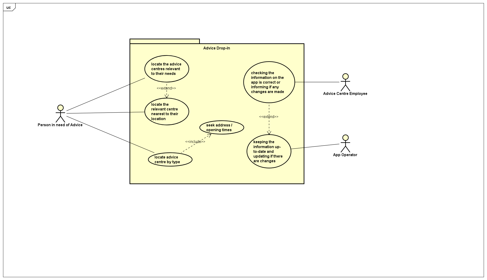

# Requirements

## User Needs

### User stories
TODO: Write brief user stories to explain how various actors would interact with the system to accomplish a goal.
    Express these in the form from agile development:- As a (role) I want (goal) so that (benefit).

As an individual struggling with debt, I want a single location so that I can seek support for my debt without stigma. 

As an individual experiencing housing problems, I want to easily be able to locate a centre nearby so that I can discuss different solutions to this. 

As a person seeking legal advice, I would like a guide on where I can locate a place of advice, so that I can make an informed decision moving forwards. 

As a person living in Bristol during the cost of living crisis, I would like a place where I can seek advice for new ways to maximise my income, so that the impact the crisis has on my household is reduced.

### Actors
TODO: List and describe the actors/users for this product.

- Advice Centre Employees 
- Local Community of Bristol
- Maintainers of the App

### Use Cases
TODO: Describe each use case (at least one per team member).
    Give each use case a unique ID, e.g. UC1, UC2, ...
    Summarise these using the use-case template below.

| USE-CASE 1 | Ensuring the correct and updated information is available on the app| 
| -------------------------------------- | ------------------- |
| **Description** |  As an employee of an advice centre, I want to ensure that the correct information about the centre is displayed on the app, so that the local community understand the services we can provide for them. |
| **Actors** | Advice centre employee |
| **Assumptions** | <ol> <li> The app has a table displaying each advice centre's name, address, opening times and types of advice. </li> <li>There is a search bar for users to search centre names</li></ol> </td></tr>
| **Steps** | <ol> <li> App will open on map, in which the user must click on the table tab to display the centres within a list </li> <li> Scroll and identify the advice centre's name </li> <li> Search for advice centre name </li> |
| **Variations** | TODO: OPTIONAL - Any variations in the steps of a use case |
| **Non-functional** | TODO: OPTIONAL - List of non-functional requirements that the use case must meet. |
| **Issues** | TODO: OPTIONAL - List of issues that remain to be resolved |

| USE-CASE 2 | Identify Free Local Finacial Advice & Support | 
| -------------------------------------- | ------------------- |
| **Description** | To identify services required through the use of keywords and provide location.
| **Actors** | Search keywords in 'Where To' to locate the required service and to be provided the geo-location or link to the location on the device software (e.g., Google maps or Apple maps).
| **Assumptions** | The user enables the collection of cookies and shares geo-location. 
| **Steps** | <ol><li> Search Keyword - e.g., Debt</li><li> Give Permission to use my location</li><li> Centre map on user</li><li> add markers for locations in proximity to user</li><li> Generate route to selected location using local software</li>
| **Variations** | TODO: OPTIONAL - Any variations in the steps of a use case |
| **Non-functional** | TODO: OPTIONAL - List of non-functional requirements that the use case must meet. |
| **Issues** | TODO: OPTIONAL - List of issues that remain to be resolved |

TODO: Your Use-Case diagram should include all use-cases.

## Software Requirements Specification
### Functional requirements
Functional Requirements:

FR1.1 The system should get permission to access the user’s location.

FR1.2 The system should query the database for advice drop-in centres from Open Data Bristol

FR1.3 The system should centre the map on the user’s location using the map object.

FR1.4 The system should add markers for each advice centre on the map

FR1.5 The system should allow users to click on which centre they would like to seek directions to

FR1.6 The system should 

### Non-Functional Requirements
TODO: Consider one or more [quality attributes](https://en.wikipedia.org/wiki/ISO/IEC_9126) to suggest a small number of non-functional requirements.
Give each non-functional requirement a unique ID. e.g. NFR1, NFR2, ...

Indicate which UC the requirement comes from.
